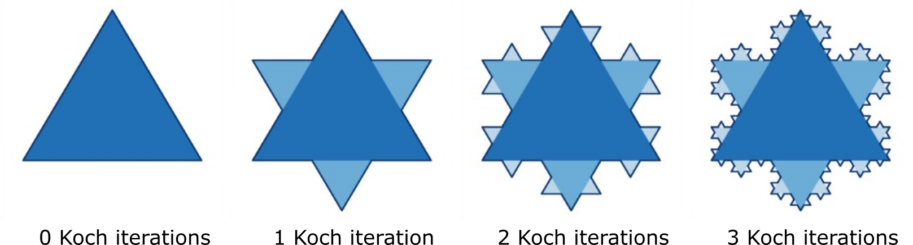
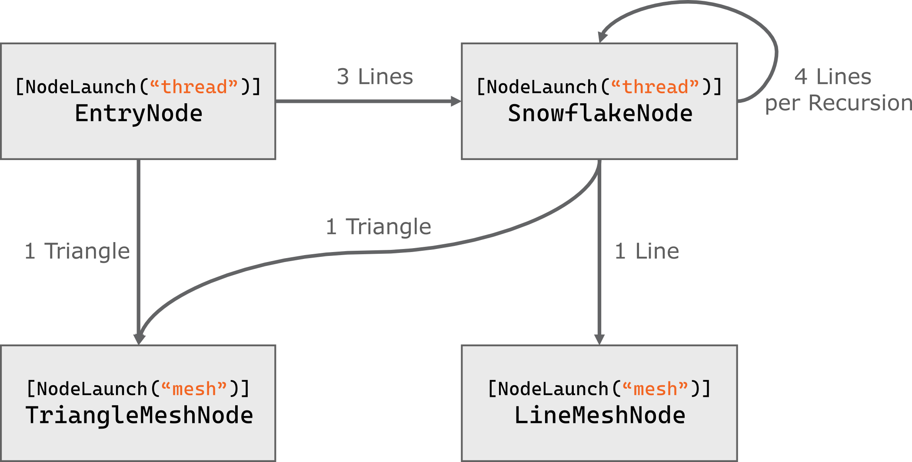

# Hello Mesh Nodes

HelloMeshNodes is a minimal, "Hello World"-style sample for [D3D12 Mesh Nodes](https://microsoft.github.io/DirectX-Specs/d3d/WorkGraphs.html#mesh-nodes). The goal of this sample is to provide short sample files which set up the minimum required in order to exercise a recursive work graph with draw nodes rendering a [Koch snowflake](https://en.wikipedia.org/wiki/Koch_snowflake).

To run the sample, open the `HelloMeshNodes.sln` with [Visual Studio 2022](https://visualstudio.microsoft.com/downloads/).
Build and run the `HelloMeshNodes` project. Visual Studio will automatically download the required Agility SDK and DirectX shader compiler packages from the NuGet package repository.

You can find more information in mesh nodes and this sample in our accompanying blog post on [GPUOpen](https://gpuopen.com/learn/work_graphs_mesh_nodes).

This sample focuses on the new mesh node feature of GPU work graphs in DirectX 12. If you are not already comfortable with DirectX 12, work graphs or mesh shaders, you may wish to learn more by reading up on these topics before continuing:
- [DirectX 12 Ultimate Getting Started Guide](https://devblogs.microsoft.com/directx/directx-12-ultimate-getting-started-guide/)
- [GPU Work Graphs Introduction](https://gpuopen.com/learn/gpu-work-graphs/gpu-work-graphs-intro/)
- [Mesh shaders on AMD RDNA™ graphics cards](https://gpuopen.com/learn/mesh_shaders/mesh_shaders-index/)

## Koch Snowflake 

The Koch snowflake is built up iteratively, in a sequence of stages. The first stage is an equilateral triangle, and each successive stage is formed by adding outward bends to each side of the previous stage, making smaller equilateral triangles. 

The work graph calculates and renders the first three iterations of the Koch snowflake.

## Work Graph Setup

The work graph draws the Koch snowflake. 
The EntryNode starts by drawing the center triangle and starting the snowflake node with the three lines of the initial triangle.
The SnowflakeNode draws a triangle in each iteration, but the last.
In the last iteration the outline is drawn. We use a depth buffer to ensure the outline always appears up top.